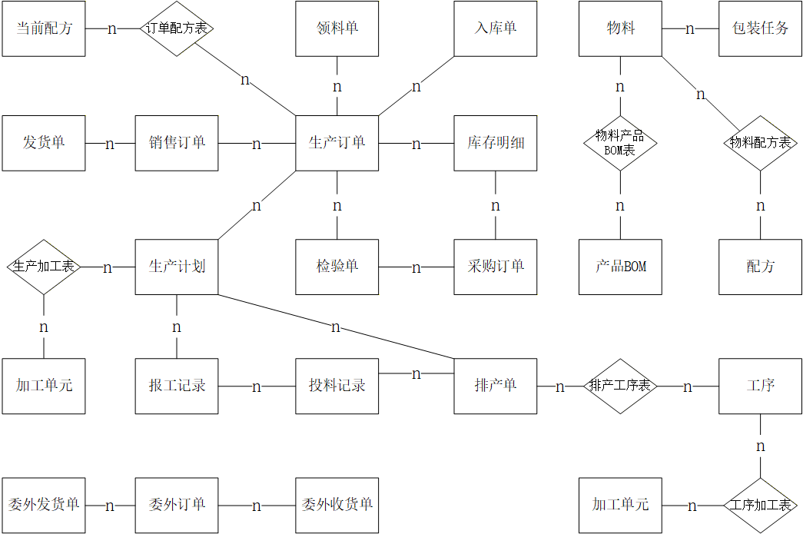
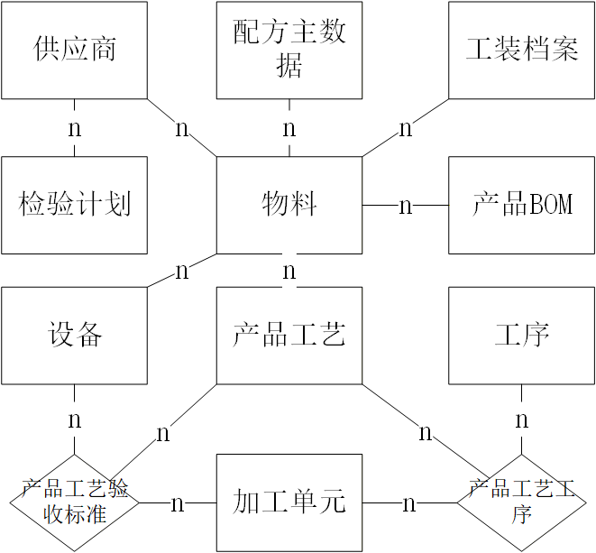
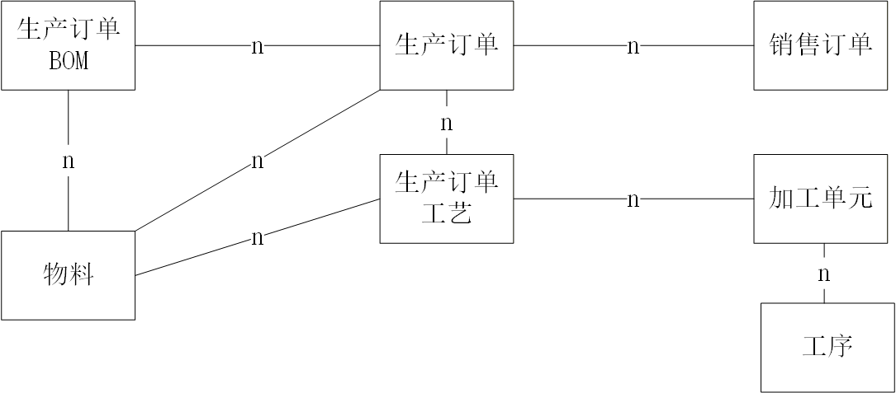
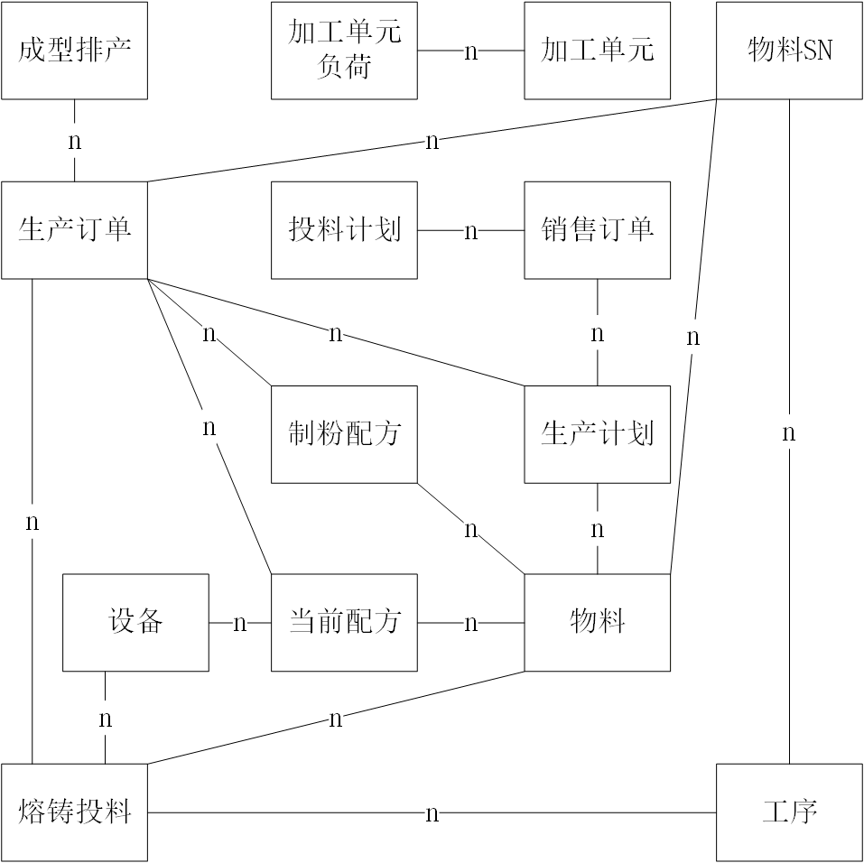
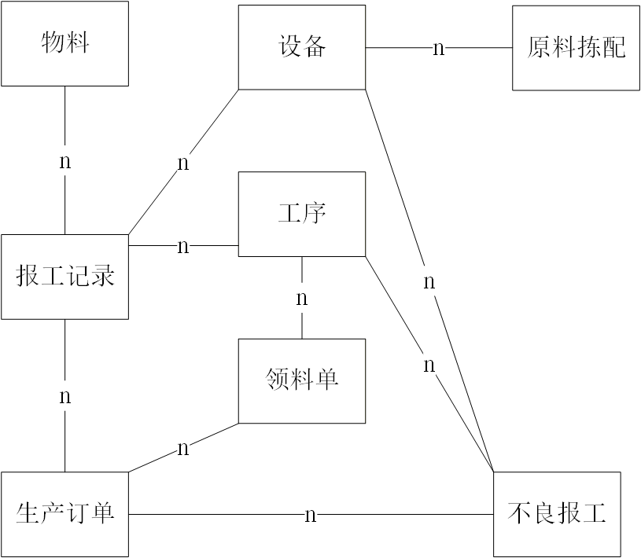
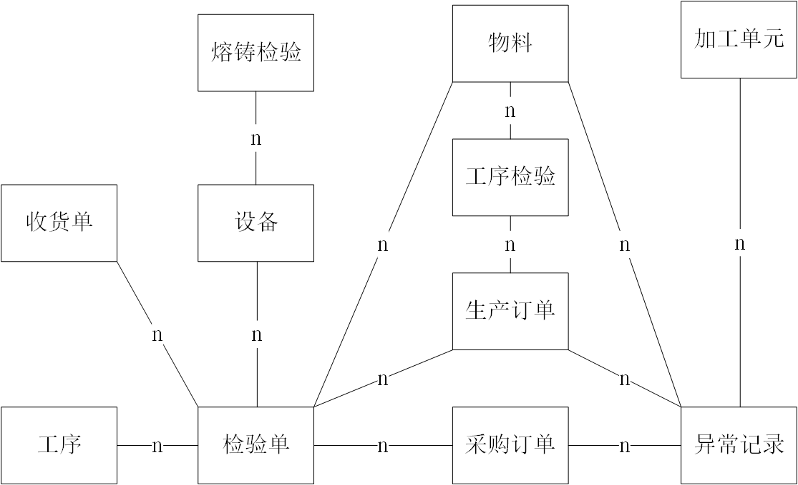
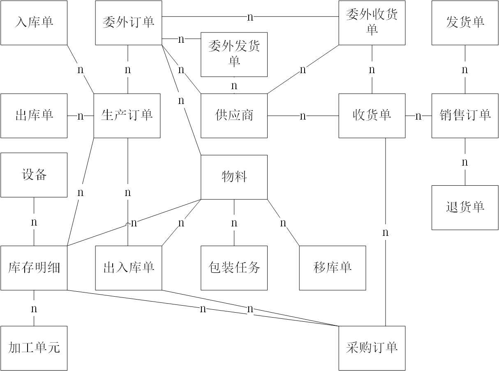

# MES 系统数据库设计文档

> **文档版本**: v1.5（设计阶段）  
> **制作时间**: 2026-08-27  
> **适用范围**: grirem MES 业务数据库  
> **作者**：袁中政
> **审核**：艾新城、孙雨

---

## 一、系统概述

本系统是一个基于 Spring Cloud 微服务架构的智能制造管理系统。

### 1.1 核心业务模块

| 模块代码 | 模块名称 | 业务职能 |
|---------|---------|---------|
| MD | 主数据管理 | 物料、客户、供应商、加工单元、设备、工艺、配方等基础数据 |
| WM | 仓储管理 | 入库、出库、库存、发货、拣配、包装、委外管理 |
| OM | 订单管理 | 销售订单、生产订单管理 |
| PP | 生产计划 | 生产计划、排产、配方管理、物料分配 |
| ES | 生产执行 | 车间执行、领料、报工、设备操作记录 |
| QM | 质量管理 | 检验计划、质量检验、异常记录 |
| SC | 供应链管理 | 采购申请、采购订单 |
| EM | 设备管理 | 设备档案、维修管理、工具管理 |
| AP | 车间排产 | 车间排产、任务分配 |
| MR | 物料需求 | 物料需求计划 |

## 二、通用字段规范

### 2.1 BaseEntity 继承字段

**BaseEntity 继承字段**

所有Entity类都继承自 `BaseEntity`，包含以下基础字段：

| 字段名 | 数据类型 | Key | 是否为空 | 默认值 | 字段注释 |
|-------|---------|-----|---------|-------|---------|
| id | BIGINT | PK | NO | AUTO_INCREMENT | 主键 ID |
| creator | BIGINT | | YES | NULL | 创建者 ID |
| create_date | DATETIME | | YES | NULL | 创建时间 |
| updater | BIGINT | | YES | NULL | 修改人 ID |
| update_date | DATETIME | | YES | NULL | 修改时间 |

**手动声明的通用字段**

每个实体都手动声明以下通用字段：

| 字段名 | 数据类型 | 是否为空 | 默认值 | 字段注释 |
|-------|---------|---------|-------|---------|
| foreign_id | BIGINT | YES | NULL | 外键/外部系统 ID |
| tenant_code | BIGINT | YES | NULL | 租户编码（多租户隔离） |
| del_flag | INT | YES | 0 | 删除标识（0-正常，1-删除） |
| import_uid | VARCHAR(64) | YES | NULL | 导入唯一标识 |
| import_pid | VARCHAR(64) | YES | NULL | 导入父级标识 |

---

## 三、核心业务实体关系

### 3.1 主表关系总览

系统各业务域主表之间的一对多 (1:N) 和多对多 (M:N) 关系如下：

**说明**：上图展示了订单 (OM)、计划 (PP)、排产 (AP)、执行 (ES)、质量 (QM)、供应链 (SC)、仓储 (WM)、设备 (EM)、物料需求 (MR) 等域与主数据 (MD) 之间的关联关系。

### 3.2 各域详细 ER 图

**主数据域 (MD)** — 物料、客户、供应商、工序、加工单元、设备、工艺、配方等基础数据

**订单管理域 (OM)** — 销售订单、生产订单及其关联关系

**生产计划域 (PP)** — 生产计划、排产、配方、投料计划

**生产执行域 (ES)** — 领料、报工、设备运行记录

**质量管理域 (QM)** — 检验计划、检验单、异常记录

**仓储管理域 (WM)** — 入库、出库、库存、发货、拣配、包装、委外

---

## 四、数据库设计规范

### 4.1 命名规范

| 对象类型 | 命名规则 | 示例 |
|---------|---------|------|
| 表名 | 小写 + 下划线，模块前缀 | `md_wl`, `om_xsdd` |
| 主键 | `id` | `id` |
| 外键 | 引用表名缩写 + `_id` 或业务字段 + `Id` | `khhid`, `dept_id` |
| 字段名 | 小写 + 下划线，匈牙利命名法 (f 前缀) | `fwlh`, `fkhmc` |
| 索引 | `idx_` + 字段名 | `idx_fwlh` |
| 从表/明细表 | 主表名 + `_mx` / `_ms` / `_item` | `wm_rk_mx` |
| 视图 | `v_` + 模块前缀 + 表名 | `v_pp_scjh_ms` |

### 4.2 索引设计原则

1. **主键索引**: 所有表必须有主键 `id`
2. **业务主键**: 单号类字段建立唯一索引 (如 `fxsddh`, `fscddh`)
3. **外键索引**: 关联字段建立普通索引 (如 `fkhbh`, `fwlh`)
4. **查询优化**: 高频查询条件字段建立复合索引

### 4.3 微服务数据边界

| 服务 | 独有数据 | 共享数据 (通过 API) |
|-----|---------|-------------------|
| MD | 所有主数据 | 向其他服务提供基础数据 |
| OM | 销售订单、生产订单 | 引用 MD 的物料、客户 |
| PP | 生产计划、排产 | 引用 OM 订单，MD 工艺 |
| ES | 领料、报工记录 | 引用 OM 订单，MD 物料 |
| WM | 库存、出入库 | 引用 MD 物料、仓库 |
| QM | 检验单、检验项目 | 引用 OM 订单，MD 检验计划 |
| SC | 采购申请、采购订单 | 引用 MD 供应商 |
| EM | 维修单、工具档案 | 引用 MD 设备 |
| AP | 排产单、任务 | 引用 OM 订单 |
| MR | 物料需求计划 | 引用 PP 计划，MD 物料 |

### 4.4 数据一致性保障

1. **强一致性**: 同服务内主从表通过事务保障
2. **最终一致性**: 跨服务通过消息队列异步同步
3. **冗余字段**: 为提高查询性能，适当冗余名称类字段 (如 `fkhmc`, `fwlmc`)

---

*文档版本：v1.5（设计阶段）*  
*制作时间：2026-08-27*
