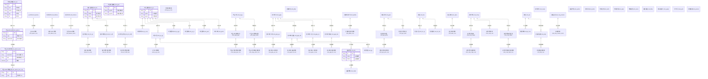

```mermaid
---
config:
  layout: elk
  er:
    direction: TB
---
erDiagram
    %% ===== 物料主数据聚合根 =====
    md_wl["物料主数据 (md_wl)"] {
        string id PK
        string fwlh "物料号"
        string fwlmc "物料名称"
        string fgg "规格"
        string fdl "单位"
    }
    
    %% ===== BOM 相关 =====
    md_cpbom["产品 BOM 主表 (md_cpbom)"] {
        string id PK
        string fwlh "物料号 FK"
        string fcpbombh "BOM 编号"
    }
    md_cpbom_item["产品 BOM 明细 (md_cpbom_item)"] {
        string id PK
        string fcpbombh "BOM 编号 FK"
        string fwlh "明细物料号 FK"
        decimal fsl "数量"
    }
    md_cpbom_item_ms["产品 BOM 明细主表 (md_cpbom_item_ms)"] {
        string id PK
        string fwlh "物料号 FK"
    }
    
    md_zjbom["主 BOM (md_zjbom)"]
    md_zjbom_mx["主 BOM 明细 (md_zjbom_mx)"]
    md_dtbom["动态 BOM (md_dtbom)"]
    md_dtbom_mx["动态 BOM 明细 (md_dtbom_mx)"]
    md_bzbom["包装 BOM (md_bzbom)"]
    md_bzbom_item["包装 BOM 明细 (md_bzbom_item)"]
    
    md_wl ||--|{ md_cpbom : "组成 BOM"
    md_cpbom ||--|{ md_cpbom_item : "包含明细"
    md_cpbom_item }|--|| md_cpbom_item_ms : "归属主表"
    md_zjbom ||--|{ md_zjbom_mx : "包含明细"
    md_dtbom ||--|{ md_dtbom_mx : "包含明细"
    md_bzbom ||--o{ md_bzbom_item : "BOM 明细"
    
    %% ===== 客户相关 =====
    md_kh["客户主数据 (md_kh)"] {
        string id PK
        string fkhbh "客户编号"
        string fkhmc "客户名称"
    }
    md_kh_xy["客户协议 (md_kh_xy)"]
    md_kh_xy_ms["客户协议明细 (md_kh_xy_ms)"]
    md_kh_sdf["客户收费项目 (md_kh_sdf)"]
    md_kh_sdf_ms["客户收费项目明细 (md_kh_sdf_ms)"]
    md_kh_shdf["客户收货地址 (md_kh_shdf)"]
    md_kh_shdf_ms["客户收货地址明细 (md_kh_shdf_ms)"]
    
    md_kh ||--o{ md_kh_xy : "签订协议"
    md_kh_xy ||--o{ md_kh_xy_ms : "协议明细"
    md_kh ||--o{ md_kh_sdf : "收费项目"
    md_kh_sdf ||--o{ md_kh_sdf_ms : "收费明细"
    md_kh ||--o{ md_kh_shdf : "收货地址"
    md_kh_shdf ||--o{ md_kh_shdf_ms : "地址明细"
    
    %% ===== 供应商相关 =====
    md_gys["供应商主数据 (md_gys)"] {
        string id PK
        string fgysbh "供应商编号"
        string fgysmc "供应商名称"
    }
    
    %% ===== 工艺相关 =====
    md_gx["工艺主数据 (md_gx)"] {
        string id PK
        string fgxbh "工序编号"
        string fgxmc "工序名称"
    }
    md_gx_ms["工艺明细 (md_gx_ms)"]
    md_gx_gj["工艺工装 (md_gx_gj)"]
    md_gx_gj_ms["工艺工装明细 (md_gx_gj_ms)"]
    md_gx_jgl["工艺结果率 (md_gx_jgl)"]
    md_gx_jt["工艺集体 (md_gx_jt)"]
    md_gx_jt_ms["工艺集体明细 (md_gx_jt_ms)"]
    md_gxxl["工艺路线 (md_gxxl)"]
    md_gzdn["工序工单 (md_gzdn)"]
    md_cpgy["产品工艺 (md_cpgy)"]
    md_cpgy_jgxl["产品工艺结果序列 (md_cpgy_jgxl)"]
    md_cpgy_jgxl_ms["产品工艺结果序列明细 (md_cpgy_jgxl_ms)"]
    md_cpgy_ysbz["产品工艺原始标准 (md_cpgy_ysbz)"]
    md_cpgy_ysbz_ms["产品工艺原始标准明细 (md_cpgy_ysbz_ms)"]
    
    md_gx ||--o{ md_gx_ms : "工艺明细"
    md_gx ||--o{ md_gx_gj : "使用工装"
    md_gx_gj ||--o{ md_gx_gj_ms : "工装明细"
    md_gx ||--o{ md_gx_jgl : "结果率"
    md_gx ||--o{ md_gx_jt : "集体"
    md_gx ||--o{ md_gxxl : "工艺路线"
    md_gx ||--o{ md_gzdn : "工序工单"
    md_cpgy ||--o{ md_cpgy_jgxl : "结果序列"
    md_cpgy_jgxl ||--o{ md_cpgy_jgxl_ms : "序列明细"
    md_cpgy ||--o{ md_cpgy_ysbz : "原始标准"
    md_cpgy_ysbz ||--o{ md_cpgy_ysbz_ms : "标准明细"
    
    %% ===== 加工单元配置 =====
    md_jgdy["加工单元 (md_jgdy)"]
    md_jgdy_gx["加工单元工序 (md_jgdy_gx)"]
    md_jgdy_gx_ms["加工单元工序明细 (md_jgdy_gx_ms)"]
    md_jgdy_sb["加工单元设备 (md_jgdy_sb)"]
    md_jgdy_sb_ms["加工单元设备明细 (md_jgdy_sb_ms)"]
    md_jgdy_ry["加工单元人员 (md_jgdy_ry)"]
    md_jgdy_ry_ms["加工单元人员明细 (md_jgdy_ry_ms)"]
    md_jgdy_bz["加工单元班组 (md_jgdy_bz)"]
    md_jgdy_bz_ms["加工单元班组明细 (md_jgdy_bz_ms)"]
    
    md_jgdy ||--o{ md_jgdy_gx : "配置工序"
    md_jgdy_gx ||--o{ md_jgdy_gx_ms : "工序明细"
    md_jgdy ||--o{ md_jgdy_sb : "配置设备"
    md_jgdy_sb ||--o{ md_jgdy_sb_ms : "设备明细"
    md_jgdy ||--o{ md_jgdy_ry : "配置人员"
    md_jgdy_ry ||--o{ md_jgdy_ry_ms : "人员明细"
    md_jgdy ||--o{ md_jgdy_bz : "配置班组"
    md_jgdy_bz ||--o{ md_jgdy_bz_ms : "班组明细"
    
    %% ===== 设备相关 =====
    md_sb["设备档案 (md_sb)"] {
        string id PK
        string fsbbh "设备编号"
        string fsbmc "设备名称"
    }
    md_sbwl["设备物料 (md_sbwl)"]
    
    md_jgdy_sb ||--o{ md_sb : "配置设备"
    md_sb ||--o{ md_sbwl : "设备物料"
    
    %% ===== 工装相关 =====
    md_gj["工装档案 (md_gj)"]
    md_gx_gj ||--o{ md_gj : "使用工装"
    
    %% ===== 计量单位 =====
    md_jldw["计量单位 (md_jldw)"]
    md_jldwfs["计量单位方式 (md_jldwfs)"]
    md_jldwfs_ms["计量单位方式明细 (md_jldwfs_ms)"]
    
    md_jldwfs ||--o{ md_jldwfs_ms : "方式明细"
    
    %% ===== 检验计划 =====
    md_jyjh["检验计划 (md_jyjh)"]
    md_jyjh_jyxm["检验计划项目 (md_jyjh_jyxm)"]
    md_jyjh_jyxm_ms["检验计划项目明细 (md_jyjh_jyxm_ms)"]
    md_jyjh_pdx["检验计划判定项 (md_jyjh_pdx)"]
    
    md_jyjh ||--o{ md_jyjh_jyxm : "检验项目"
    md_jyjh_jyxm ||--o{ md_jyjh_jyxm_ms : "项目明细"
    md_jyjh ||--o{ md_jyjh_pdx : "判定项"
    
    %% ===== 班组 =====
    md_bz["班组 (md_bz)"]
    md_bz_ry["班组人员 (md_bz_ry)"]
    md_bz_bc["班组班次 (md_bz_bc)"]
    
    md_bz ||--o{ md_bz_ry : "班组人员"
    md_bz ||--o{ md_bz_bc : "班组班次"
    
    %% ===== 安全库存 =====
    md_aqkc["安全库存 (md_aqkc)"]
    md_aqkc_mx["安全库存明细 (md_aqkc_mx)"]
    
    md_aqkc ||--o{ md_aqkc_mx : "库存明细"
    
    %% ===== 农场代码 =====
    md_ncdy["农场代码 (md_ncdy)"]
    md_ncdy_ckgh["农场代码仓库 (md_ncdy_ckgh)"]
    md_ncdy_ckgh_ms["农场代码仓库明细 (md_ncdy_ckgh_ms)"]
    md_ncdy_cw["农场代码财务 (md_ncdy_cw)"]
    md_ncdy_hjbz["农场代码环保标准 (md_ncdy_hjbz)"]
    md_ncdy_hjbz_ms["农场代码环保标准明细 (md_ncdy_hjbz_ms)"]
    
    md_ncdy ||--o{ md_ncdy_ckgh : "农场仓库"
    md_ncdy_ckgh ||--o{ md_ncdy_ckgh_ms : "仓库明细"
    md_ncdy ||--o{ md_ncdy_cw : "农场财务"
    md_ncdy ||--o{ md_ncdy_hjbz : "环保标准"
    md_ncdy_hjbz ||--o{ md_ncdy_hjbz_ms : "标准明细"
    
    %% ===== 批发 =====
    md_pf["批发 (md_pf)"]
    md_pf_mx["批发明细 (md_pf_mx)"]
    md_pfsj["批发供应商 (md_pfsj)"]
    md_pfsj_mx["批发供应商明细 (md_pfsj_mx)"]
    
    md_pf ||--o{ md_pf_mx : "批发明细"
    md_pf ||--o{ md_pfsj : "批发供应商"
    md_pfsj ||--o{ md_pfsj_mx : "供应商明细"
    
    %% ===== 其他主数据 =====
    md_cwxs["财务方式 (md_cwxs)"]
    md_msg_master["消息主表 (md_msg_master)"]
    md_msg_master_item["消息明细 (md_msg_master_item)"]
    md_qxdm["权限代码 (md_qxdm)"]
    md_yhbz["用户标准 (md_yhbz)"]
    md_wlfz["物料复制 (md_wlfz)"]
    md_wlgl["物料管理 (md_wlgl)"]
    md_wlsx["物料属性 (md_wlsx)"]
    md_lfrdj["来料等级 (md_lfrdj)"]
    md_yxjdy["优先级定义 (md_yxjdy)"]
    md_gcrl["工厂日历 (md_gcrl)"]
    md_param["参数配置 (md_param)"]
    
    md_msg_master ||--o{ md_msg_master_item : "消息明细"
    
    %% ===== 外部模块关联 =====
    %% md_wl -> om_xsdd : "被销售订单引用"
    %% md_wl -> om_scdd : "被生产订单引用"
    %% md_wl -> wm_kc : "被库存引用"
    %% md_kh -> om_xsdd : "下单客户"
    %% md_kh -> wm_shd : "收货客户"
    %% md_gys -> sc_cgdd : "供应采购订单"
    %% md_gx -> om_scdd_gy : "工序工艺"
    %% md_jgdy -> pp_scjh : "作业单元"
    %% md_sb -> em_wxd : "维修设备"
```
