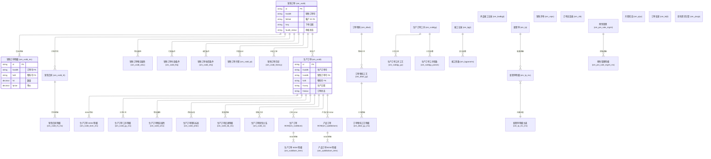

```mermaid
---
config:
  layout: elk
  er:
    direction: TB
---
erDiagram
    %% ===== 销售订单聚合根 =====
    om_xsdd["销售订单 (om_xsdd)"] {
        string id PK
        string fxsddh "销售订单号"
        string fkhhid "客户 ID FK"
        string fxrq "下单日期"
        string faudit_status "审核状态"
    }
    om_xsdd_ms["销售订单明细 (om_xsdd_ms)"] {
        string id PK
        string fxsddh "订单号 FK"
        string fwlh "物料号 FK"
        decimal fsl "数量"
        decimal fprice "单价"
    }
    om_xsdd_ht["销售合同 (om_xsdd_ht)"]
    om_xsdd_ht_ms["销售合同明细 (om_xsdd_ht_ms)"]
    om_xsdd_wlsx["销售订单物流属性 (om_xsdd_wlsx)"]
    om_xsdd_fktj["销售订单付款条件 (om_xsdd_fktj)"]
    om_xsdd_shtj["销售订单收货条件 (om_xsdd_shtj)"]
    om_xsdd_qt["销售订单齐套 (om_xsdd_qt)"]
    om_xsdd_history["销售订单历史 (om_xsdd_history)"]
    
    om_xsdd ||--|{ om_xsdd_ms : "包含明细"
    om_xsdd ||--o{ om_xsdd_ht : "关联合同"
    om_xsdd_ht ||--|{ om_xsdd_ht_ms : "合同明细"
    om_xsdd ||--o{ om_xsdd_wlsx : "物流属性"
    om_xsdd ||--o{ om_xsdd_fktj : "付款条件"
    om_xsdd ||--o{ om_xsdd_shtj : "收货条件"
    om_xsdd ||--o{ om_xsdd_qt : "齐套标记"
    om_xsdd ||--o{ om_xsdd_history : "历史订单"
    
    %% ===== 生产订单聚合根 =====
    om_scdd["生产订单 (om_scdd)"] {
        string id PK
        string fscddh "生产订单号"
        string fxsddh "销售订单号 FK"
        string fwlh "物料号 FK"
        string fscsrq "生产日期"
        string fstatus "订单状态"
    }
    om_scdd_bom_ms["生产订单 BOM 明细 (om_scdd_bom_ms)"]
    om_scdd_gy_ms["生产订单工序明细 (om_scdd_gy_ms)"]
    om_scdd_wlsx["生产订单物流属性 (om_scdd_wlsx)"]
    om_scdd_yhbz["生产订单用料标准 (om_scdd_yhbz)"]
    om_scdd_bd_ms["生产订单变更明细 (om_scdd_bd_ms)"]
    om_scdd_xs["生产订单销售关系 (om_scdd_xs)"]
    om_scddbom["生产订单 BOM(om_scddbom)"]
    om_scddbom_item["生产订单 BOM 明细 (om_scddbom_item)"]
    om_cpddbzbom["产品订单 BOM(om_cpddbzbom)"]
    om_cpddbzbom_item["产品订单 BOM 明细 (om_cpddbzbom_item)"]
    
    om_scdd ||--|{ om_scdd_bom_ms : "BOM 用料"
    om_scdd ||--|{ om_scdd_gy_ms : "工序工艺"
    om_scdd ||--o{ om_scdd_wlsx : "物流属性"
    om_scdd ||--o{ om_scdd_yhbz : "用料标准"
    om_scdd ||--o{ om_scdd_bd_ms : "变更明细"
    om_scdd ||--o{ om_scdd_xs : "销售关系"
    om_scdd ||--o{ om_scddbom : "订单 BOM"
    om_scddbom ||--|{ om_scddbom_item : "BOM 明细"
    om_scdd ||--o{ om_cpddbzbom : "产品订单 BOM"
    om_cpddbzbom ||--|{ om_cpddbzbom_item : "BOM 明细"
    
    %% ===== 订单物料 =====
    om_ddwl["订单物料 (om_ddwl)"]
    om_ddwl_gy["订单物料工艺 (om_ddwl_gy)"]
    om_ddwl_gy_ms["订单物料工艺明细 (om_ddwl_gy_ms)"]
    
    om_ddwl ||--o{ om_ddwl_gy : "物料工艺"
    om_ddwl_gy ||--o{ om_ddwl_gy_ms : "工艺明细"
    
    %% ===== 生产订单工序 =====
    om_scddgy["生产订单工序 (om_scddgy)"]
    om_scddgy_gx["生产订单工序工艺 (om_scddgy_gx)"]
    om_scddgy_param["生产订单工序参数 (om_scddgy_param)"]
    
    om_scddgy ||--o{ om_scddgy_gx : "工序工艺"
    om_scddgy ||--o{ om_scddgy_param : "工序参数"
    
    %% ===== 报工记录 =====
    om_bgjl["报工记录 (om_bgjl)"]
    om_bgparams["报工参数 (om_bgparams)"]
    om_badbgjl["坏品报工记录 (om_badbgjl)"]
    
    om_bgjl ||--o{ om_bgparams : "报工参数"
    
    %% ===== 配套单 =====
    om_tp["配套单 (om_tp)"]
    om_tp_mx["配套单明细 (om_tp_mx)"]
    om_tp_mx_ms["配套单明细主表 (om_tp_mx_ms)"]
    
    om_tp ||--o{ om_tp_mx : "配套明细"
    om_tp_mx }|--|| om_tp_mx_ms : "归属主表"
    
    %% ===== 其他实体 =====
    om_xsps["销售评审 (om_xsps)"]
    om_ztb["订单追踪表 (om_ztb)"]
    om_pre_sale_mgmt["预售管理 (om_pre_sale_mgmt)"]
    om_pro_sale_mgmt_ms["预售管理明细 (om_pro_sale_mgmt_ms)"]
    om_qtyc["齐套检查 (om_qtyc)"]
    om_bdjl["订单变更 (om_bdjl)"]
    om_ylxqjs["原料需求计算 (om_ylxqjs)"]
    
    om_pre_sale_mgmt ||--o{ om_pro_sale_mgmt_ms : "预售明细"
    
    %% ===== 订单关联 =====
    om_xsdd ||--o{ om_scdd : "转生产"
    
    %% ===== 外部模块关联 =====
    %% om_xsdd -> md_kh : "下单客户"
    %% om_xsdd -> md_jldw : "合同单位"
    %% om_scdd -> md_wl : "生产物料"
    %% om_scdd -> md_gx : "工序工艺"
    %% om_scdd -> pp_scjh : "被生产计划引用"
    %% om_scdd -> wm_rk : "完工入库"
    %% om_scdd -> es_lld : "领料"
    %% om_scdd -> qm_jyd : "报检"
    %% om_xsdd -> wm_shd : "发货"
    %% om_xsdd -> wm_picking : "拣货"
```
