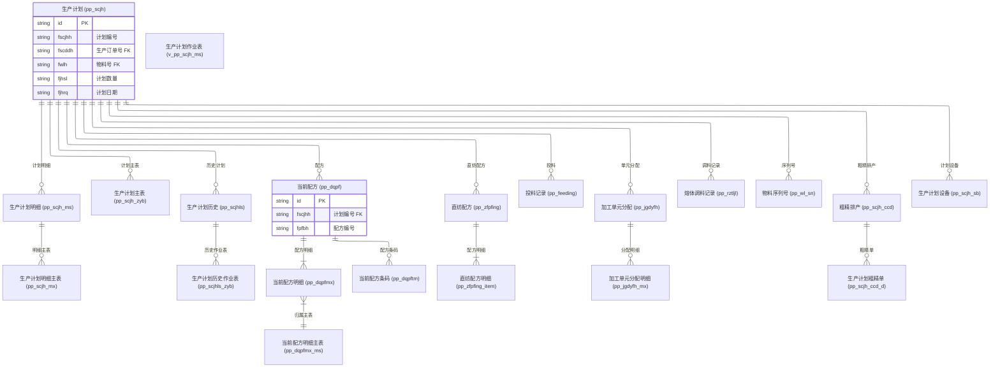

```mermaid
---
config:
  layout: elk
  er:
    direction: TB
---
erDiagram
    %% ===== 生产计划聚合根 =====
    pp_scjh["生产计划 (pp_scjh)"] {
        string id PK
        string fscjhh "计划编号"
        string fscddh "生产订单号 FK"
        string fwlh "物料号 FK"
        string fjhsl "计划数量"
        string fjhrq "计划日期"
    }
    pp_scjh_ms["生产计划明细 (pp_scjh_ms)"]
    pp_scjh_mx["生产计划明细主表 (pp_scjh_mx)"]
    pp_scjh_zyb["生产计划主表 (pp_scjh_zyb)"]
    pp_scjhls["生产计划历史 (pp_scjhls)"]
    pp_scjhls_zyb["生产计划历史作业表 (pp_scjhls_zyb)"]
    
    pp_scjh ||--o{ pp_scjh_ms : "计划明细"
    pp_scjh_ms ||--o{ pp_scjh_mx : "明细主表"
    pp_scjh ||--o{ pp_scjh_zyb : "计划主表"
    pp_scjh ||--o{ pp_scjhls : "历史计划"
    pp_scjhls ||--o{ pp_scjhls_zyb : "历史作业表"
    
    %% ===== 配方相关 =====
    pp_dqpf["当前配方 (pp_dqpf)"] {
        string id PK
        string fscjhh "计划编号 FK"
        string fpfbh "配方编号"
    }
    pp_dqpfmx["当前配方明细 (pp_dqpfmx)"]
    pp_dqpfmx_ms["当前配方明细主表 (pp_dqpfmx_ms)"]
    pp_dqpftm["当前配方条码 (pp_dqpftm)"]
    pp_zfpfing["直纺配方 (pp_zfpfing)"]
    pp_zfpfing_item["直纺配方明细 (pp_zfpfing_item)"]
    
    pp_scjh ||--o{ pp_dqpf : "配方"
    pp_dqpf ||--|{ pp_dqpfmx : "配方明细"
    pp_dqpfmx }|--|| pp_dqpfmx_ms : "归属主表"
    pp_dqpf ||--o{ pp_dqpftm : "配方条码"
    pp_scjh ||--o{ pp_zfpfing : "直纺配方"
    pp_zfpfing ||--|{ pp_zfpfing_item : "配方明细"
    
    %% ===== 执行相关 =====
    pp_feeding["投料记录 (pp_feeding)"]
    pp_jgdyfh["加工单元分配 (pp_jgdyfh)"]
    pp_jgdyfh_mx["加工单元分配明细 (pp_jgdyfh_mx)"]
    pp_rztljl["熔体调料记录 (pp_rztljl)"]
    pp_wl_sn["物料序列号 (pp_wl_sn)"]
    pp_scjh_ccd["粗精排产 (pp_scjh_ccd)"]
    pp_scjh_ccd_d["生产计划粗精单 (pp_scjh_ccd_d)"]
    pp_scjh_sb["生产计划设备 (pp_scjh_sb)"]
    v_pp_scjh_ms["生产计划作业表 (v_pp_scjh_ms)"]
    
    pp_scjh ||--o{ pp_feeding : "投料"
    pp_scjh ||--o{ pp_jgdyfh : "单元分配"
    pp_jgdyfh ||--o{ pp_jgdyfh_mx : "分配明细"
    pp_scjh ||--o{ pp_rztljl : "调料记录"
    pp_scjh ||--o{ pp_wl_sn : "序列号"
    pp_scjh ||--o{ pp_scjh_ccd : "粗精排产"
    pp_scjh_ccd ||--o{ pp_scjh_ccd_d : "粗精单"
    pp_scjh ||--o{ pp_scjh_sb : "计划设备"
    
    %% ===== 外部模块关联 =====
    %% pp_scjh -> om_scdd : "计划订单"
    %% pp_scjh -> md_wl : "计划物料"
    %% pp_scjh -> md_jgdy : "作业单元"
    %% pp_scjh -> ap_pcd : "被排产单引用"
    %% pp_scjh -> wm_ck : "计划仓库"
    %% pp_scjh -> md_sb : "计划设备"
    %% pp_feeding -> wm_kc : "投料库存"
    %% pp_wl_sn -> wm_kc : "序列库存"
```
