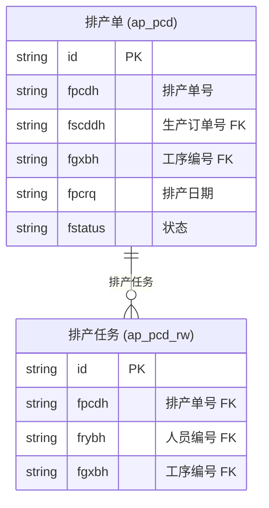

```mermaid
---
config:
  layout: elk
  er:
    direction: TB
---
erDiagram
    %% ===== 排产单聚合根 =====
    ap_pcd["排产单 (ap_pcd)"] {
        string id PK
        string fpcdh "排产单号"
        string fscddh "生产订单号 FK"
        string fgxbh "工序编号 FK"
        string fpcrq "排产日期"
        string fstatus "状态"
    }
    ap_pcd_rw["排产任务 (ap_pcd_rw)"] {
        string id PK
        string fpcdh "排产单号 FK"
        string frybh "人员编号 FK"
        string fgxbh "工序编号 FK"
    }
    
    ap_pcd ||--o{ ap_pcd_rw : "排产任务"
    
    %% ===== 外部模块关联 =====
    %% ap_pcd -> om_scdd : "排产订单"
    %% ap_pcd -> md_gx : "排产工序"
    %% ap_pcd -> pp_scjh : "计划来源"
    %% ap_pcd -> sys_dept : "排产部门"
    %% ap_pcd -> sys_user : "排产人"
```
