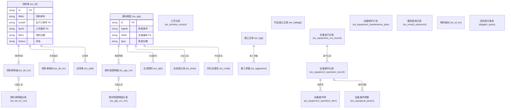

```mermaid
---
config:
  layout: elk
  er:
    direction: TB
---
erDiagram
    %% ===== 领料单聚合根 =====
    es_lld["领料单 (es_lld)"] {
        string id PK
        string flldbh "领料单号"
        string fscddh "生产订单号 FK"
        string fgxbh "工序编号 FK"
        string flldrq "领料日期"
        string fstatus "状态"
    }
    es_lld_mx["领料单明细 (es_lld_mx)"]
    es_lld_mx_ms["领料单明细主表 (es_lld_mx_ms)"]
    es_lld_tm["领料单条码 (es_lld_tm)"]
    es_yldb["应领单 (es_yldb)"]
    
    es_lld ||--|{ es_lld_mx : "领料明细"
    es_lld_mx }|--|| es_lld_mx_ms : "归属主表"
    es_lld ||--o{ es_lld_tm : "领料条码"
    es_lld ||--o{ es_yldb : "应领单"
    
    %% ===== 原料拣配聚合根 =====
    es_yljp["原料拣配 (es_yljp)"] {
        string id PK
        string fyljpdh "拣配单号"
        string fsbbh "设备编号 FK"
        string fjprq "拣配日期"
    }
    es_yljp_mx["原料拣配明细 (es_yljp_mx)"]
    es_yljp_mx_ms["原料拣配明细主表 (es_yljp_mx_ms)"]
    es_hjbl["合泥配料 (es_hjbl)"]
    es_nhsb["合泥烧记录 (es_nhsb)"]
    es_rcxhjl["内化试报告 (es_rcxhjl)"]
    
    es_yljp ||--o{ es_yljp_mx : "拣配明细"
    es_yljp_mx }|--|| es_yljp_mx_ms : "归属主表"
    es_yljp ||--o{ es_hjbl : "合泥配料"
    es_yljp ||--o{ es_nhsb : "合泥记录"
    es_yljp ||--o{ es_rcxhjl : "内化报告"
    
    %% ===== 工艺记录 =====
    es_technics_record["工艺记录 (es_technics_record)"]
    es_bgjl["报工记录 (es_bgjl)"]
    es_bgparams["报工参数 (es_bgparams)"]
    es_badbgjl["坏品报工记录 (es_badbgjl)"]
    
    es_bgjl ||--o{ es_bgparams : "报工参数"
    
    %% ===== 设备相关 =====
    es_equipment_run_record["设备运行记录 (es_equipment_run_record)"]
    es_equipment_operation_record["设备操作记录 (es_equipment_operation_record)"]
    es_equipment_operation_item["设备操作项 (es_equipment_operation_item)"]
    es_equoperat_param["设备操作参数 (es_equoperat_param)"]
    es_equipment_maintenance_plan["设备维护计划 (es_equipment_maintenance_plan)"]
    es_mould_userecord["模具使用记录 (es_mould_userecord)"]
    
    es_equipment_run_record ||--o{ es_equipment_operation_record : "操作记录"
    es_equipment_operation_record ||--o{ es_equoperat_param : "操作参数"
    es_equipment_operation_record ||--o{ es_equipment_operation_item : "操作项"
    
    %% ===== 物料条码 =====
    es_wl_tm["物料条码 (es_wl_tm)"]
    
    %% ===== 当前配方查询 =====
    dqpgtm_query["当前配方查询 (dqpgtm_query)"]
    
    %% ===== 外部模块关联 =====
    %% es_lld -> om_scdd : "领料订单"
    %% es_lld -> wm_kc : "扣减库存"
    %% es_lld -> md_gx : "领料工序"
    %% es_yljp -> md_sb : "拣配设备"
    %% es_yljp -> md_wl : "拣配物料"
    %% es_bgjl -> om_scdd : "报工订单"
    %% es_bgjl -> md_gx : "报工工序"
    %% es_bgjl -> md_sb : "报工设备"
    %% es_technics_record -> om_scdd : "工艺订单"
    %% es_technics_record -> md_gx : "工艺工序"
    %% es_technics_record -> md_sb : "工艺设备"
    %% es_mould_userecord -> md_gj : "使用模具"
    %% es_equipment_maintenance_plan -> md_sb : "维护设备"
```
