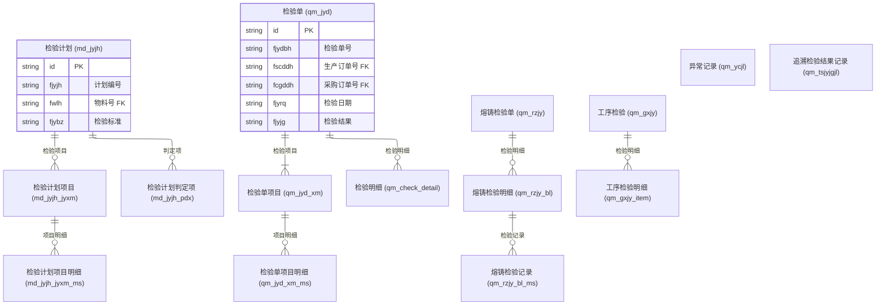

```mermaid
---
config:
  layout: elk
  er:
    direction: TB
---
erDiagram
    %% ===== 检验计划聚合根 =====
    md_jyjh["检验计划 (md_jyjh)"] {
        string id PK
        string fjyjh "计划编号"
        string fwlh "物料号 FK"
        string fjybz "检验标准"
    }
    md_jyjh_jyxm["检验计划项目 (md_jyjh_jyxm)"]
    md_jyjh_jyxm_ms["检验计划项目明细 (md_jyjh_jyxm_ms)"]
    md_jyjh_pdx["检验计划判定项 (md_jyjh_pdx)"]
    
    md_jyjh ||--o{ md_jyjh_jyxm : "检验项目"
    md_jyjh_jyxm ||--o{ md_jyjh_jyxm_ms : "项目明细"
    md_jyjh ||--o{ md_jyjh_pdx : "判定项"
    
    %% ===== 检验单聚合根 =====
    qm_jyd["检验单 (qm_jyd)"] {
        string id PK
        string fjydbh "检验单号"
        string fscddh "生产订单号 FK"
        string fcgddh "采购订单号 FK"
        string fjyrq "检验日期"
        string fjyjg "检验结果"
    }
    qm_jyd_xm["检验单项目 (qm_jyd_xm)"]
    qm_jyd_xm_ms["检验单项目明细 (qm_jyd_xm_ms)"]
    qm_check_detail["检验明细 (qm_check_detail)"]
    
    qm_jyd ||--|{ qm_jyd_xm : "检验项目"
    qm_jyd_xm ||--o{ qm_jyd_xm_ms : "项目明细"
    qm_jyd ||--o{ qm_check_detail : "检验明细"
    
    %% ===== 熔铸检验 =====
    qm_rzjy["熔铸检验单 (qm_rzjy)"]
    qm_rzjy_bl["熔铸检验明细 (qm_rzjy_bl)"]
    qm_rzjy_bl_ms["熔铸检验记录 (qm_rzjy_bl_ms)"]
    
    qm_rzjy ||--o{ qm_rzjy_bl : "检验明细"
    qm_rzjy_bl ||--o{ qm_rzjy_bl_ms : "检验记录"
    
    %% ===== 工序检验 =====
    qm_gxjy["工序检验 (qm_gxjy)"]
    qm_gxjy_item["工序检验明细 (qm_gxjy_item)"]
    
    qm_gxjy ||--o{ qm_gxjy_item : "检验明细"
    
    %% ===== 异常与追溯 =====
    qm_ycjl["异常记录 (qm_ycjl)"]
    qm_tsjyjgjl["追溯检验结果记录 (qm_tsjyjgjl)"]
    
    %% ===== 外部模块关联 =====
    %% qm_jyd -> om_scdd : "报检订单"
    %% qm_jyd -> sc_cgdd : "来料检验"
    %% qm_jyd -> md_jyjh : "检验标准"
    %% qm_jyd -> md_wl : "检验物料"
    %% qm_jyd -> md_sb : "检验设备"
    %% qm_gxjy -> om_scdd : "检验订单"
    %% qm_gxjy -> md_gx : "检验工序"
    %% qm_ycjl -> om_scdd : "异常订单"
    %% qm_ycjl -> md_gx : "异常工序"
    %% qm_tsjyjgjl -> qm_jyd : "检验结果"
```
