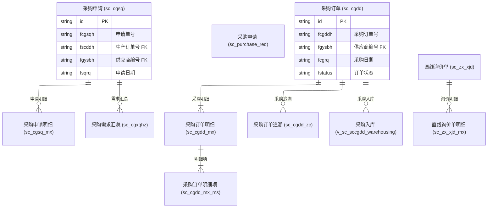

```mermaid
---
config:
  layout: elk
  er:
    direction: TB
---
erDiagram
    %% ===== 采购申请聚合根 =====
    sc_cgsq["采购申请 (sc_cgsq)"] {
        string id PK
        string fcgsqh "申请单号"
        string fscddh "生产订单号 FK"
        string fgysbh "供应商编号 FK"
        string fsqrq "申请日期"
    }
    sc_cgsq_mx["采购申请明细 (sc_cgsq_mx)"]
    sc_cgxqhz["采购需求汇总 (sc_cgxqhz)"]
    sc_purchase_req["采购申请 (sc_purchase_req)"]
    
    sc_cgsq ||--o{ sc_cgsq_mx : "申请明细"
    sc_cgsq ||--o{ sc_cgxqhz : "需求汇总"
    
    %% ===== 采购订单聚合根 =====
    sc_cgdd["采购订单 (sc_cgdd)"] {
        string id PK
        string fcgddh "采购订单号"
        string fgysbh "供应商编号 FK"
        string fcgrq "采购日期"
        string fstatus "订单状态"
    }
    sc_cgdd_mx["采购订单明细 (sc_cgdd_mx)"]
    sc_cgdd_mx_ms["采购订单明细项 (sc_cgdd_mx_ms)"]
    sc_cgdd_zc["采购订单追溯 (sc_cgdd_zc)"]
    v_sc_sccgdd_warehousing["采购入库 (v_sc_sccgdd_warehousing)"]
    
    sc_cgdd ||--|{ sc_cgdd_mx : "采购明细"
    sc_cgdd_mx ||--|{ sc_cgdd_mx_ms : "明细项"
    sc_cgdd ||--o{ sc_cgdd_zc : "采购追溯"
    sc_cgdd ||--o{ v_sc_sccgdd_warehousing : "采购入库"
    
    %% ===== 直线询价 =====
    sc_zx_xjd["直线询价单 (sc_zx_xjd)"]
    sc_zx_xjd_mx["直线询价单明细 (sc_zx_xjd_mx)"]
    
    sc_zx_xjd ||--o{ sc_zx_xjd_mx : "询价明细"
    
    %% ===== 外部模块关联 =====
    %% sc_cgsq -> om_scdd : "申请订单"
    %% sc_cgsq -> md_gys : "申请供应商"
    %% sc_cgsq -> md_wl : "申请物料"
    %% sc_cgdd -> md_gys : "采购供应商"
    %% sc_cgdd -> md_wl : "采购物料"
    %% sc_cgdd -> qm_jyd : "来料检验"
    %% sc_cgdd -> wm_rk : "采购入库"
    %% sc_zx_xjd -> md_gys : "询价供应商"
    %% sc_zx_xjd -> md_wl : "询价物料"
```
