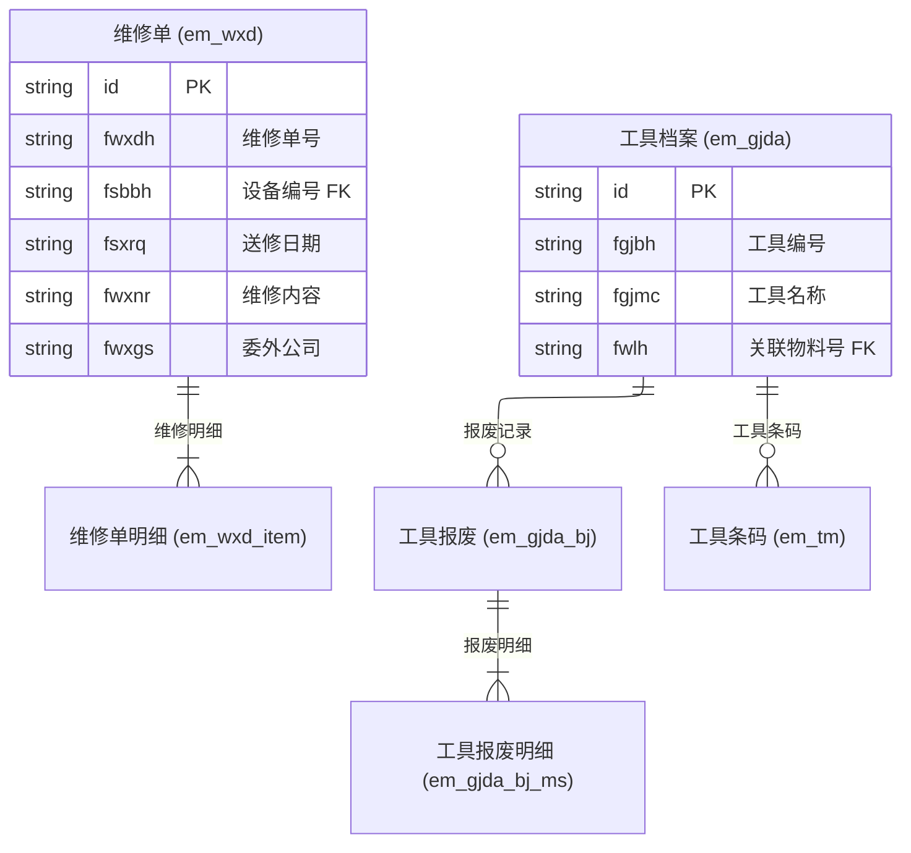

```mermaid
---
config:
  layout: elk
  er:
    direction: TB
---
erDiagram
    %% ===== 维修单聚合根 =====
    em_wxd["维修单 (em_wxd)"] {
        string id PK
        string fwxdh "维修单号"
        string fsbbh "设备编号 FK"
        string fsxrq "送修日期"
        string fwxnr "维修内容"
        string fwxgs "委外公司"
    }
    em_wxd_item["维修单明细 (em_wxd_item)"]
    
    em_wxd ||--|{ em_wxd_item : "维修明细"
    
    %% ===== 工具档案聚合根 =====
    em_gjda["工具档案 (em_gjda)"] {
        string id PK
        string fgjbh "工具编号"
        string fgjmc "工具名称"
        string fwlh "关联物料号 FK"
    }
    em_gjda_bj["工具报废 (em_gjda_bj)"]
    em_gjda_bj_ms["工具报废明细 (em_gjda_bj_ms)"]
    em_tm["工具条码 (em_tm)"]
    
    em_gjda ||--o{ em_gjda_bj : "报废记录"
    em_gjda_bj ||--|{ em_gjda_bj_ms : "报废明细"
    em_gjda ||--o{ em_tm : "工具条码"
    
    %% ===== 外部模块关联 =====
    %% em_wxd -> md_sb : "维修设备"
    %% em_wxd -> sys_factory : "所属工厂"
    %% em_wxd -> sys_wwgs : "委外公司"
    %% em_gjda -> md_wl : "关联物料"
    %% em_gjda_bj -> md_wl : "报废物料"
    %% em_tm -> wm_kc : "条码库存"
```
