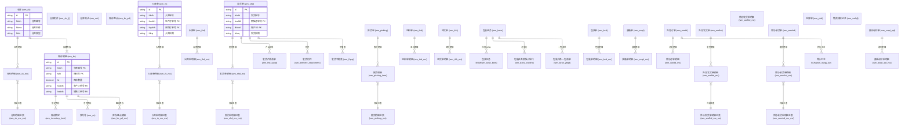

```mermaid
---
config:
  layout: elk
  er:
    direction: TB
---
erDiagram
    %% ===== 仓库聚合根 =====
    wm_ck["仓库 (wm_ck)"] {
        string id PK
        string fckbh "仓库编号"
        string fckmc "仓库名称"
        string fcklx "仓库类型"
    }
    wm_ck_mx["仓库明细 (wm_ck_mx)"]
    wm_ck_mx_ms["仓库明细主表 (wm_ck_mx_ms)"]
    wm_ck_fj["仓库附件 (wm_ck_fj)"]
    wm_crk["仓库测试 (wm_crk)"]
    
    wm_ck ||--o{ wm_ck_mx : "仓库明细"
    wm_ck_mx }|--|| wm_ck_mx_ms : "归属主表"
    
    %% ===== 库存明细聚合根 =====
    wm_kc["库存明细 (wm_kc)"] {
        string id PK
        string fckbh "仓库编号 FK"
        string fwlh "物料号 FK"
        decimal fsl "库存数量"
        string fscddh "生产订单号 FK"
        string fxsddh "销售订单号 FK"
    }
    wm_inventory_lock["库存锁定 (wm_inventory_lock)"]
    wm_sn["序列号 (wm_sn)"]
    wm_kc_pd["库存盘点 (wm_kc_pd)"]
    wm_kc_pd_mx["库存盘点明细 (wm_kc_pd_mx)"]
    
    wm_ck ||--|{ wm_kc : "存储库存"
    wm_kc ||--o{ wm_inventory_lock : "锁定库存"
    wm_kc ||--o{ wm_sn : "序列库存"
    wm_kc ||--o{ wm_kc_pd_mx : "盘点库存"
    
    %% ===== 入库单聚合根 =====
    wm_rk["入库单 (wm_rk)"] {
        string id PK
        string frkdh "入库单号"
        string fscddh "生产订单号 FK"
        string fcgddh "采购订单号 FK"
        string frkrq "入库日期"
    }
    wm_rk_mx["入库单明细 (wm_rk_mx)"]
    wm_rk_mx_ms["入库单明细主表 (wm_rk_mx_ms)"]
    
    wm_rk ||--|{ wm_rk_mx : "入库明细"
    wm_rk_mx }|--|| wm_rk_mx_ms : "归属主表"
    
    %% ===== 出库单 =====
    wm_fhd["出库单 (wm_fhd)"]
    wm_fhd_mx["出库单明细 (wm_fhd_mx)"]
    
    wm_fhd ||--o{ wm_fhd_mx : "出库明细"
    
    %% ===== 发货单聚合根 =====
    wm_shd["发货单 (wm_shd)"] {
        string id PK
        string fshdh "发货单号"
        string fxsddh "销售订单号 FK"
        string fkhhid "客户 ID FK"
        string fshrq "发货日期"
    }
    wm_shd_mx["发货单明细 (wm_shd_mx)"]
    wm_shd_mx_ms["发货单明细主表 (wm_shd_mx_ms)"]
    wm_fhd_cpqd["发货产品清单 (wm_fhd_cpqd)"]
    wm_delivery_attachment["发货附件 (wm_delivery_attachment)"]
    wm_fhpp["发货平衡表 (wm_fhpp)"]
    
    wm_shd ||--|{ wm_shd_mx : "发货明细"
    wm_shd_mx }|--|| wm_shd_mx_ms : "归属主表"
    wm_shd ||--o{ wm_fhd_cpqd : "产品清单"
    wm_shd ||--o{ wm_delivery_attachment : "附件"
    wm_shd ||--o{ wm_fhpp : "平衡表"
    
    %% ===== 拣货单 =====
    wm_picking["拣货单 (wm_picking)"]
    wm_picking_item["拣货明细 (wm_picking_item)"]
    wm_picking_ms["拣货明细主表 (wm_picking_ms)"]
    
    wm_picking ||--o{ wm_picking_item : "拣货明细"
    wm_picking_item }|--|| wm_picking_ms : "归属主表"
    
    %% ===== 退料/退货 =====
    wm_thd["退料单 (wm_thd)"]
    wm_thd_mx["退料单明细 (wm_thd_mx)"]
    wm_thh["退货单 (wm_thh)"]
    wm_thh_mx["退货单明细 (wm_thh_mx)"]
    
    wm_thd ||--o{ wm_thd_mx : "退料明细"
    wm_thh ||--o{ wm_thh_mx : "退货明细"
    
    %% ===== 包装相关 =====
    wm_bzrw["包装任务 (wm_bzrw)"]
    wm_bzrw_bom["包装任务 BOM(wm_bzrw_bom)"]
    wm_bzrw_xsddhx["包装任务销售订单行 (wm_bzrw_xsddhx)"]
    wm_bzrw_ybqd["包装任务一包清单 (wm_bzrw_ybqd)"]
    wm_bzd["包装单 (wm_bzd)"]
    wm_bzd_mx["包装单明细 (wm_bzd_mx)"]
    wm_zxqd["装箱单 (wm_zxqd)"]
    wm_zxqd_mx["装箱单明细 (wm_zxqd_mx)"]
    
    wm_bzrw ||--o{ wm_bzrw_bom : "任务 BOM"
    wm_bzrw ||--o{ wm_bzrw_xsddhx : "订单行"
    wm_bzrw ||--o{ wm_bzrw_ybqd : "一包清单"
    wm_bzd ||--o{ wm_bzd_mx : "包装明细"
    wm_zxqd ||--o{ wm_zxqd_mx : "装箱明细"
    
    %% ===== 外协相关 =====
    wm_wwdd["外协订单 (wm_wwdd)"]
    wm_wwdd_mx["外协订单明细 (wm_wwdd_mx)"]
    wm_wwfhd["外协发货单 (wm_wwfhd)"]
    wm_wwfhd_ms["外协发货单明细 (wm_wwfhd_ms)"]
    wm_wwfhd_mx["外协发货单明细 (wm_wwfhd_mx)"]
    wm_wwfhd_mx_ms["外协发货单明细主表 (wm_wwfhd_mx_ms)"]
    wm_wwshd["外协收货单 (wm_wwshd)"]
    wm_wwshd_mx["外协收货单明细 (wm_wwshd_mx)"]
    wm_wwshd_mx_ms["外协收货单明细主表 (wm_wwshd_mx_ms)"]
    wm_wwgy_bz["外协工艺 BOM(wm_wwgy_bz)"]
    
    wm_wwdd ||--o{ wm_wwdd_mx : "订单明细"
    wm_wwfhd ||--o{ wm_wwfhd_mx : "发货明细"
    wm_wwfhd_mx }|--|| wm_wwfhd_mx_ms : "归属主表"
    wm_wwshd ||--o{ wm_wwshd_mx : "收货明细"
    wm_wwshd_mx }|--|| wm_wwshd_mx_ms : "归属主表"
    wm_wwdd ||--o{ wm_wwgy_bz : "外协工艺"
    
    %% ===== 其他 =====
    wm_ykd["应库单 (wm_ykd)"]
    wm_zwlhjl["物资流转记录 (wm_zwlhjl)"]
    wm_zxqd_xjd["直线询价单 (wm_zxqd_xjd)"]
    wm_zxqd_xjd_mx["直线询价单明细 (wm_zxqd_xjd_mx)"]
    
    wm_zxqd_xjd ||--o{ wm_zxqd_xjd_mx : "询价明细"
    
    %% ===== 外部模块关联 =====
    %% wm_kc -> md_wl : "库存物料"
    %% wm_rk -> om_scdd : "入库订单"
    %% wm_rk -> sc_cgdd : "采购入库"
    %% wm_shd -> om_xsdd : "发货订单"
    %% wm_shd -> md_kh : "收货客户"
    %% wm_picking -> om_xsdd : "拣货订单"
    %% wm_picking -> md_kh : "拣货客户"
    %% wm_thd -> om_scdd : "退料订单"
    %% wm_thh -> md_kh : "退货客户"
    %% wm_bzrw -> md_kh : "任务客户"
    %% wm_bzrw -> md_jldw : "包装单位"
    %% wm_wwdd -> md_gys : "外协供应商"
    %% wm_wwfhd -> md_gys : "发货供应商"
    %% wm_wwshd -> md_gys : "收货供应商"
    %% wm_zwlhjl -> md_wl : "流转物料"
    %% wm_ykd -> wm_rk : "应库入库"
```
