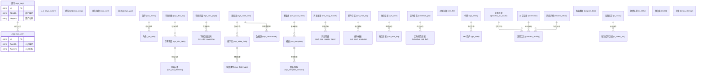

```mermaid
---
config:
  layout: elk
  er:
    direction: TB
---
erDiagram
    %% ===== 组织人员 =====
    sys_dept["部门 (sys_dept)"] {
        string id PK
        string fdeptbh "部门编号"
        string fdeptmc "部门名称"
    }
    sys_user["人员 (sys_user)"] {
        string id PK
        string fuserbh "人员编号"
        string fusermc "人员名称"
    }
    sys_factory["工厂 (sys_factory)"]
    sys_wwgs["委外公司 (sys_wwgs)"]
    sys_xszz["销售组织 (sys_xszz)"]
    sys_ywy["业务员 (sys_ywy)"]
    
    sys_dept ||--o{ sys_user : "部门人员"
    
    %% ===== 系统基础 =====
    sys_menu["菜单 (sys_menu)"]
    sys_role["角色 (sys_role)"]
    sys_dict_obj["字典对象 (sys_dict_obj)"]
    sys_dict_field["字典字段 (sys_dict_field)"]
    sys_dict_element["字典元素 (sys_dict_element)"]
    sys_dict_page["字典页面 (sys_dict_page)"]
    sys_dict_pagestru["字典页面结构 (sys_dict_pagestru)"]
    sys_table_info["表信息 (sys_table_info)"]
    sys_table_field["表字段 (sys_table_field)"]
    sys_field_type["字段类型 (sys_field_type)"]
    sys_datasource["数据源 (sys_datasource)"]
    sys_base_class["基础类 (sys_base_class)"]
    sys_template["模板 (sys_template)"]
    sys_template_version["模板版本 (sys_template_version)"]
    
    sys_menu ||--o{ sys_role : "角色菜单"
    sys_dict_obj ||--o{ sys_dict_field : "包含字段"
    sys_dict_field ||--o{ sys_dict_element : "包含元素"
    sys_dict_page ||--o{ sys_dict_pagestru : "页面结构"
    sys_table_info ||--o{ sys_table_field : "包含字段"
    sys_table_field ||--o{ sys_field_type : "字段类型"
    sys_table_info ||--o{ sys_datasource : "所属数据源"
    sys_base_class ||--o{ sys_template : "基础模板"
    sys_template ||--o{ sys_template_version : "模板版本"
    
    %% ===== 消息 =====
    md_msg_master["消息主表 (md_msg_master)"]
    md_msg_master_item["消息明细 (md_msg_master_item)"]
    sys_mail_log["邮件日志 (sys_mail_log)"]
    sys_mail_template["邮件模板 (sys_mail_template)"]
    sys_sms["短信记录 (sys_sms)"]
    sys_sms_log["短信日志 (sys_sms_log)"]
    
    md_msg_master ||--o{ md_msg_master_item : "消息明细"
    sys_mail_log ||--o{ sys_mail_template : "使用模板"
    sys_sms ||--o{ sys_sms_log : "短信日志"
    
    %% ===== 定时任务 =====
    schedule_job["定时任务 (schedule_job)"]
    schedule_job_log["定时任务日志 (schedule_job_log)"]
    
    schedule_job ||--o{ schedule_job_log : "任务日志"
    
    %% ===== OSS =====
    oss_file["对象存储 (oss_file)"]
    
    %% ===== API =====
    api_token["令牌 (api_token)"]
    api_user["API 用户 (api_user)"]
    
    api_token ||--o{ api_user : "用户令牌"
    
    %% ===== Activiti 工作流 =====
    process_biz_route["业务流程 (process_biz_route)"]
    process_activity["流程活动 (process_activity)"]
    correction["纠正记录 (correction)"]
    history_detail["历史详情 (history_detail)"]
    
    process_biz_route ||--o{ process_activity : "包含活动"
    correction ||--o{ process_activity : "纠正流程"
    history_detail ||--o{ process_activity : "流程历史"
    
    %% ===== 报表 =====
    ureport_data["报表数据 (ureport_data)"]
    v_zzxkc["在制库存 (v_zzxkc)"]
    v_zzxkc_his["在制库存历史 (v_zzxkc_his)"]
    v_sfchz["收费汇总 (v_sfchz)"]
    wxbb["微信表 (wxbb)"]
    
    v_zzxkc ||--o{ v_zzxkc_his : "历史库存"
    
    %% ===== 存储 =====
    seata_storage["存储 (seata_storage)"]
    
    %% ===== 跨域关联 =====
    %% sys_dept -> om_xsdd : "负责部门"
    %% sys_user -> om_xsdd : "创建人"
    %% sys_factory -> em_wxd : "所属工厂"
    %% sys_xszz -> om_xsdd : "销售组织"
    %% sys_ywy -> om_xsdd : "负责业务员"
    %% sys_wwgs -> wm_wwdd : "委外供应商"
```
